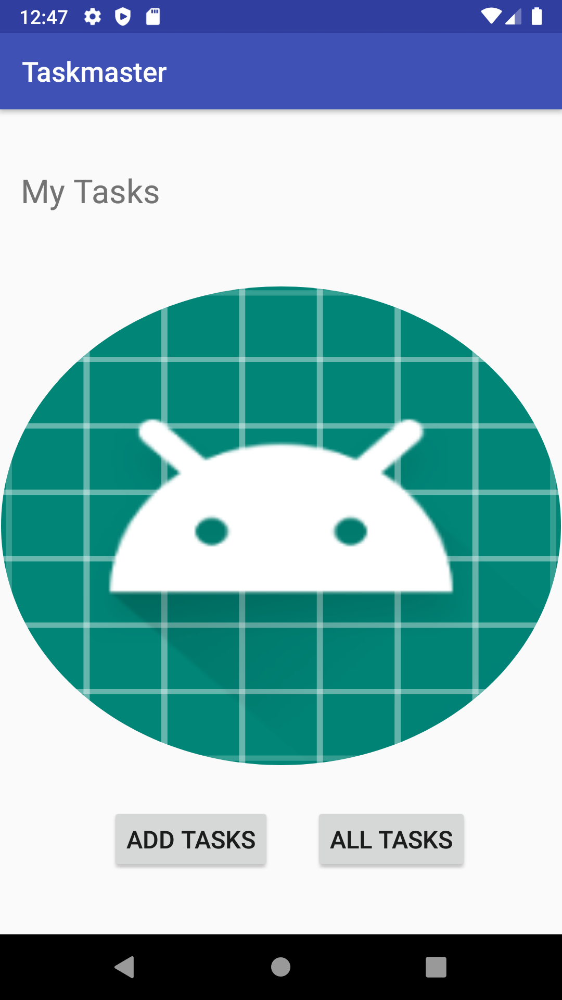

#  TaskMaster 
<!-- Short summary or background information -->
Start building an Android app that will be a main focus of the second half of the course: TaskMaster.
## Challenge Description
<!-- Description of the challenge -->
Create a new directory and repo to hold this app. Name it taskmaster. Within that directory, use Android Studio to set up a new app, as discussed in class
#### 11FEB2020
<!-- What approach did you take? Why? What is the Big O space/time for this approach? -->

- Created pages for home page, AllTasks, and Add a Task.  
- Created routing to secondary pages from home screen(currently only way back to home is phone's back button)
- Add task page should allow user to add task and see confirmation by 'SUBMITTED!!!' displayed on screen
- AllTasks should show list of all tasks
 
##### Image

